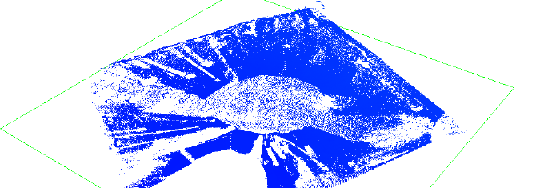
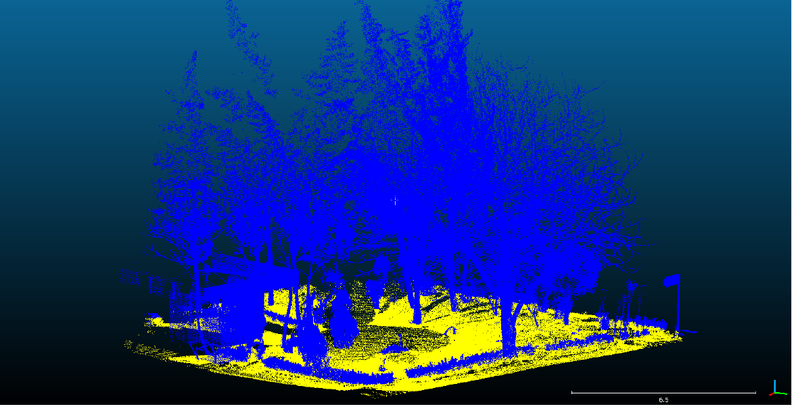
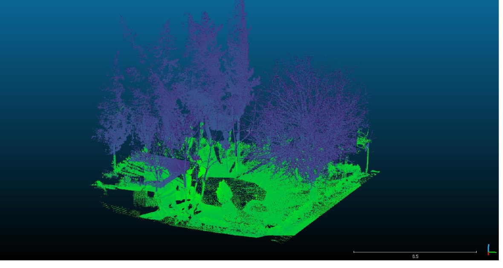
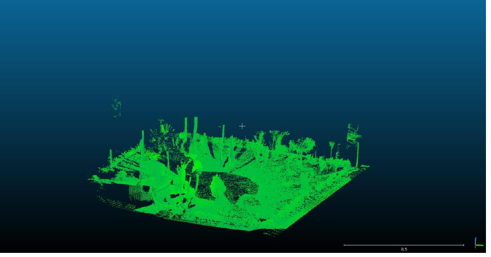
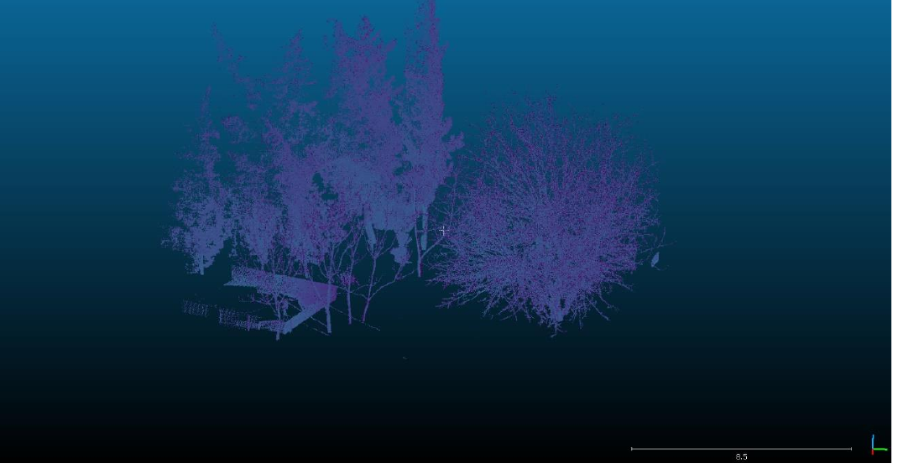
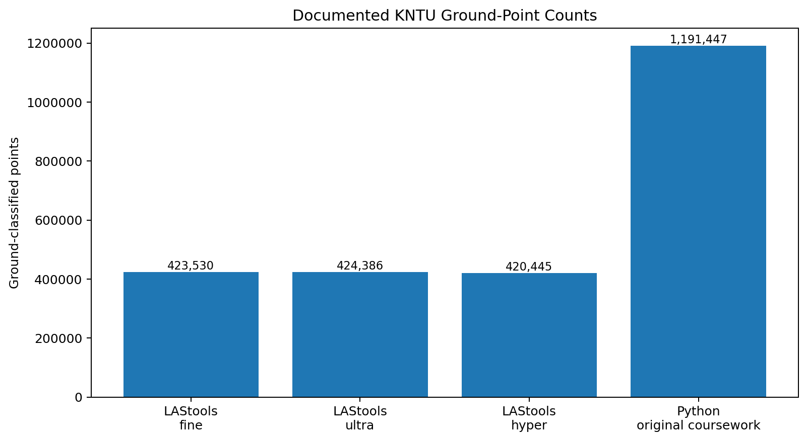
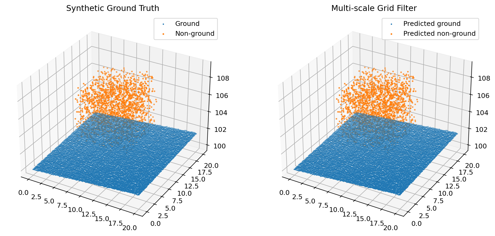

# LiDAR Ground Filtering Comparison

A portfolio-ready LiDAR point-cloud project focused on **ground / non-ground classification** and comparison of three workflows:

- LAStools ground filtering
- Global Mapper automatic point-cloud classification
- a custom Python grid-based ground filter

The project originated from graduate coursework in **Advanced Laser Scanning: Processing and Applications** at K. N. Toosi University of Technology.

## Project Overview

The core task is to separate terrain points from vegetation, buildings, and other above-ground objects so the ground subset can be used for products such as a **Digital Elevation Model (DEM)**.

The original coursework used two LiDAR datasets:

- **KNTU**: 2,143,352 points
- **Toronto**: 2,727,891 points, WGS 84 / UTM Zone 17N

The public repository combines documented real-project outputs with a cleaned and testable Python implementation.

## Real Project Visuals

### Toronto point cloud - elevation view

### LAStools - fine ground-filter output



### Global Mapper automatic classification

Ground and non-ground objects are visibly separated in the automatic point-cloud classification output.



### Python classification

The original Python workflow produced separate ground and non-ground subsets.



**Ground subset**



**Non-ground subset**



## Documented KNTU Results

| Method | Ground points | Ground fraction |
| --- | ---: | ---: |
| LAStools - fine | 423,530 | 19.760% |
| LAStools - ultra | 424,386 | 19.800% |
| LAStools - hyper | 420,445 | 19.616% |
| Python - original coursework | 1,191,447 | 55.588% |



The large difference between the Python count and the LAStools counts should **not** be interpreted as higher accuracy. The methods use different ground models and thresholds. The comparison is useful for studying algorithm sensitivity, not for declaring a winner without independent ground truth.

## Python Implementation

The submitted coursework script used a 2 m XY grid and the minimum elevation inside each cell as the local ground reference.

One important issue was corrected before publication:

- the original script computed the cell minima only once;
- it then used thresholds of 2, 4, 6, 8, and 10 m;
- the masks were combined with logical AND.

Because every later threshold is less restrictive than the first threshold, the five-iteration loop is mathematically equivalent to **one 2 m threshold pass**.

This repository therefore provides two implementations.

### 1. `legacy_fixed_grid_filter`

A clean, direct equivalent of the original coursework behavior. This is useful for reproducing the original Python result when the KNTU LAS file is available.

### 2. `multiscale_grid_ground_filter`

The recommended refactor. Each iteration changes the grid resolution, so the local minimum surface actually changes with scale.

The scale-dependent height tolerance is:

```text
height_threshold =
    base_height_threshold + slope_tolerance * grid_resolution
```

This makes the filter more meaningful on sloped terrain while remaining simple and interpretable.

## Run on a LAS File

Install dependencies:

```bash
pip install -r requirements.txt
```

Run the corrected multi-scale filter:

```bash
python examples/run_filter.py input.las --method multiscale --output-dir outputs
```

Example with custom parameters:

```bash
python examples/run_filter.py input.las   --method multiscale   --base-resolution 2.0   --scales 1 2 4   --base-threshold 0.25   --slope-tolerance 0.15   --output-dir outputs
```

To reproduce the effective logic of the original coursework script:

```bash
python examples/run_filter.py input.las   --method legacy   --base-resolution 2.0   --z-min 0   --z-max 2000
```

The command writes a classified LAS plus separate ground and non-ground LAS files. Ground uses LAS class code `2`; non-ground points are written as class code `1`.

## Synthetic Reproducibility Test

The original KNTU LAS point cloud is not redistributed in this repository.

A deterministic synthetic terrain/object point cloud is included to validate the corrected algorithm:

```bash
python examples/synthetic_demo.py
```



## Testing

Run:

```bash
python -m unittest discover -s tests
```

The tests verify:

- ground / object separation on a synthetic sloped surface;
- equivalence between the simplified legacy function and the original five-iteration coursework logic;
- Z-range filtering behavior;
- parsing of LAS metadata and classification counts.

## Repository Structure

```text
lidar-ground-filtering-comparison/
├── README.md
├── LICENSE
├── requirements.txt
├── pyproject.toml
├── .gitignore
├── src/
│   └── lidar_ground_filter/
│       ├── __init__.py
│       ├── filtering.py
│       ├── las_io.py
│       └── lasinfo.py
├── examples/
│   ├── run_filter.py
│   ├── synthetic_demo.py
│   └── benchmark_summary.py
├── tests/
│   ├── test_filtering.py
│   └── test_lasinfo.py
├── data/
│   ├── kntu_ground_counts.csv
│   ├── dataset_metadata.csv
│   └── toronto_classification.csv
├── figures/
│   ├── toronto_elevation_view.png
│   ├── lastools_fine_ground.png
│   ├── global_mapper_classification.png
│   ├── python_classification_overview.png
│   ├── python_ground_points.png
│   ├── python_non_ground_points.png
│   ├── documented_ground_counts.png
│   └── synthetic_filter_demo.png
└── docs/
    ├── refactor_notes.md
    └── coursework_results.md
```

## Scope and Limitations

- The original KNTU LAS point cloud is not included.
- Real-project numerical results are preserved as documented coursework results.
- The corrected multi-scale Python filter is validated on synthetic data; it is not claimed to have reproduced the KNTU count without the source LAS file.
- Ground-point count alone is not an accuracy metric. Independent labeled ground truth would be required for a quantitative accuracy comparison across methods.

## Research Relevance

This project demonstrates experience with:

- LiDAR point-cloud processing
- LAS data structures and classification codes
- ground / non-ground separation
- grid-based terrain filtering
- multi-scale spatial analysis
- LAStools
- Global Mapper
- Python / NumPy
- reproducible algorithm testing
- DEM-oriented preprocessing

It aligns directly with broader interests in **3D point-cloud processing, LiDAR perception, photogrammetry, and geospatial AI**.

## Author

**Reza Pourali**  
M.Sc. Student in Photogrammetry  
K. N. Toosi University of Technology
